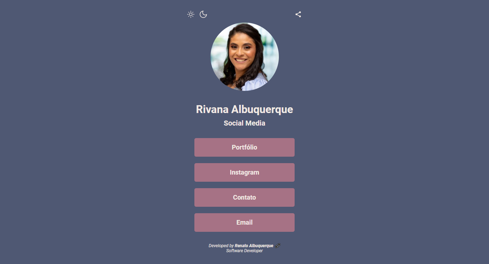
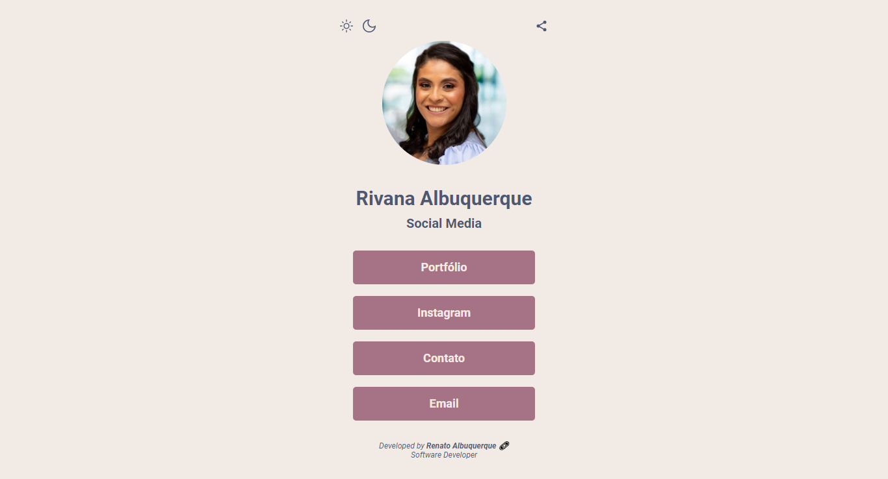

# Digital Business Card - Social Media

Freelance project developed for "Social Media Rivana Albuquerque". Purpose of grouping all the user's contacts. Project developed in Nov/2022.

## Links

- [Solution URL here](https://github.com/renato-albuquerque/rtssa-contacts)
- [Live Site URL here](https://cartaodevisita-rivana.vercel.app/)

## Screenshot

## Technologies

- Semantic HTML5 markup
- CSS custom properties
- Flexbox
- JavaScript
- Mobile-first workflow

## Author

- Business Card - [Renato Albuquerque](https://portfolio-renatoalbuquerque.vercel.app/)
- Linkedin - [renato-malbuquerque](https://www.linkedin.com/in/renato-malbuquerque/)
- Discord - [Renato Albuquerque#0025](https://discordapp.com/users/992621595547938837)
- Frontend Mentor - [@renato-albuquerque](https://www.frontendmentor.io/profile/renato-albuquerque)